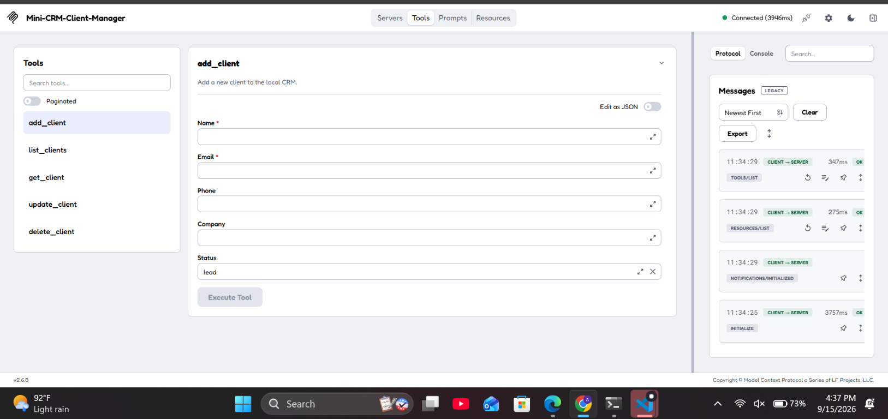
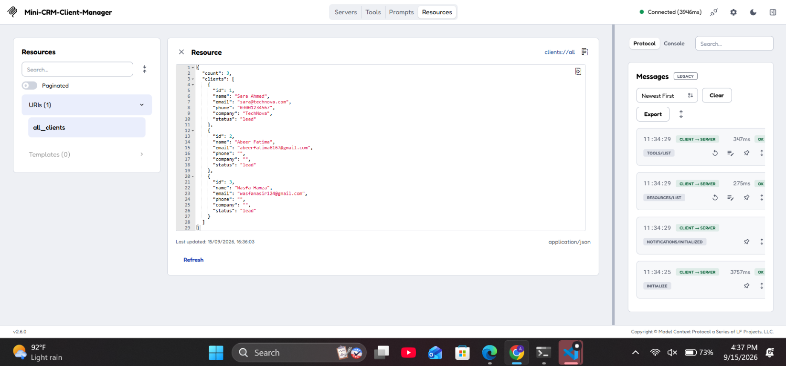
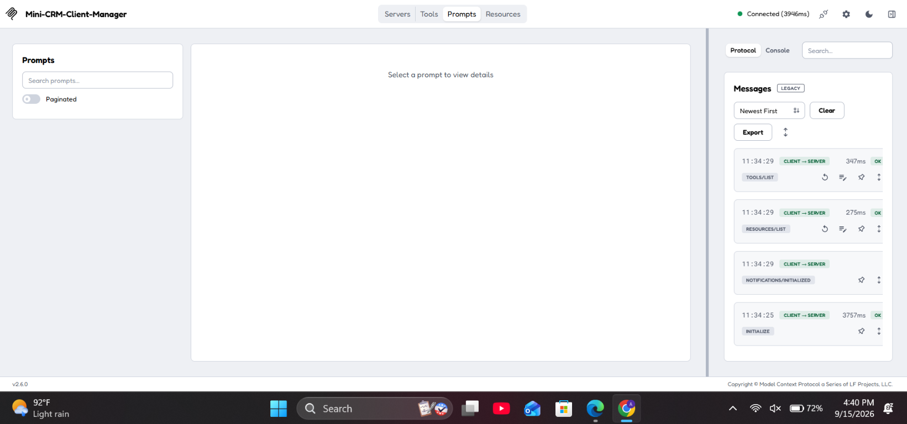

# Mini CRM / Client Manager MCP Server

Mini CRM is a local Model Context Protocol (MCP) server for managing client records. An MCP client, such as MCP Inspector, can discover the server's tools and resource and use them through the standard MCP protocol.

The project provides a focused implementation with:

- Python MCP SDK `2.2.0`
- Python `3.14`
- stdio transport
- local JSON storage
- no database, cloud service, authentication, frontend, or AI framework

## What the server provides

### MCP tools

| Tool | Purpose |
|---|---|
| `add_client` | Create a new client |
| `list_clients` | List all clients or filter by status |
| `get_client` | Retrieve one client by ID |
| `update_client` | Update one or more client fields |
| `delete_client` | Delete a client by ID |

### MCP resource

| Resource URI | Purpose |
|---|---|
| `clients://all` | Read-only JSON view of all current clients |

This server does not define custom MCP prompts. The Inspector may still display a **Prompts** tab because it is a general MCP client, but the CRM functionality is provided by the five tools and the resource above.

## Client data model

Each record has this shape:

```json
{
  "id": 1,
  "name": "Ali Khan",
  "email": "ali@example.com",
  "phone": "03001234567",
  "company": "ABC Solutions",
  "status": "lead"
}
```

Allowed statuses are `lead`, `active`, and `inactive`. IDs are generated automatically as positive integers. Email addresses must be valid and unique.

## Project files

```text
server.py         MCP server, tools, resource, validation, and JSON storage
clients.json      Local client records
requirements.txt  Python dependency declaration
README.md         Project documentation
DEMO_PLAN.md      Short live demonstration plan
VIVA_ANSWERS.md  Beginner-friendly viva answers
.gitignore        Files excluded from version control
```

## Installation

Open a PowerShell terminal in the project folder:

```powershell
cd "C:\Users\IT LAND\Downloads\Mini_CRM_MCP_Complete\mini_crm_mcp"
python -m venv venv
.\venv\Scripts\Activate.ps1
python -m pip install -r requirements.txt
```

The project requires the `mcp` Python package. The included virtual environment already contains the compatible SDK. The activation step is optional when using the explicit virtual-environment command shown below.

## Running with MCP Inspector

The reliable Windows command for this project is:

```powershell
npx --yes @modelcontextprotocol/inspector .\venv\Scripts\python.exe .\server.py
```

This starts MCP Inspector and launches `server.py` with the Python executable from the project virtual environment. It does not depend on a globally installed `uv` command.

The terminal prints a URL similar to:

```text
http://127.0.0.1:6274/?MCP_INSPECTOR_API_TOKEN=...
```

Open that URL in a browser. In Inspector:

1. Find the `python.exe` server entry.
2. Click its connection switch.
3. Wait for the status to show **Connected**.
4. Select **Tools** to use the five CRM tools.
5. Select **Resources**, choose `all_clients`, and read `clients://all`.

If port `6274` is already in use, an Inspector instance is already running. Open `http://127.0.0.1:6274` or stop the old Inspector terminal with `Ctrl+C` before starting a new one.

To run only the MCP server without Inspector:

```powershell
.\venv\Scripts\python.exe .\server.py
```

That command is useful for a direct server check, but Inspector is required for the graphical demonstration.

## Tool inputs and examples

### `add_client`

Required inputs: `name`, `email`.

Optional inputs: `phone`, `company`, and `status`. The default status is `lead`.

```json
{
  "name": "Sara Ahmed",
  "email": "sara@technova.com",
  "phone": "03001234567",
  "company": "TechNova",
  "status": "lead"
}
```

### `list_clients`

Optional input: `status`. Use `all`, `lead`, `active`, or `inactive`. The default is `all`.

```json
{
  "status": "lead"
}
```

### `get_client`

Required input: positive integer `client_id`.

```json
{
  "client_id": 1
}
```

### `update_client`

Required input: `client_id` and at least one update field. Available update fields are `name`, `email`, `phone`, `company`, and `status`. Fields that are not supplied remain unchanged.

```json
{
  "client_id": 1,
  "status": "active"
}
```

### `delete_client`

Required input: positive integer `client_id`.

```json
{
  "client_id": 1
}
```

Every tool returns a structured result. Successful results contain `"ok": true`; validation and missing-record results contain `"ok": false` and a readable error message. The server handles empty names, invalid emails, duplicate emails, invalid statuses, invalid IDs, unknown IDs, and empty update requests without crashing.

## Reading `clients://all`

`clients://all` returns a JSON document like this:

```json
{
  "count": 1,
  "clients": [
    {
      "id": 1,
      "name": "Sara Ahmed",
      "email": "sara@technova.com",
      "phone": "03001234567",
      "company": "TechNova",
      "status": "lead"
    }
  ]
}
```

It is an MCP resource, not a tool, because it provides read-only information and does not perform an operation or modify data.

## Inspector screenshots

The screenshots below show the connected MCP Inspector interface for this project.

### Available CRM tools

The **Tools** view exposes the five CRM operations: `add_client`, `list_clients`, `get_client`, `update_client`, and `delete_client`.



### Client resource

The **Resources** view shows the `clients://all` resource and its JSON response.



### Prompts view

The Inspector includes a **Prompts** view as part of its general MCP interface. This project does not define custom prompts, so the list is intentionally empty.



## Storage behavior

All records are stored in `clients.json` using Python's standard `json` module. The file can start as an empty array:

```json
[]
```

A missing or empty file is treated as an empty CRM. Malformed JSON or a file that does not contain a list of client objects is reported as a storage error. No external database is used.

## Example CRM workflow

1. Call `add_client` to create Sara Ahmed as a lead.
2. Call `list_clients` with `{"status": "lead"}` to show all leads.
3. Call `update_client` with `{"client_id": 1, "status": "active"}` when Sara becomes a customer.
4. Call `get_client` to confirm the updated record.
5. Read `clients://all` to view the complete current CRM.

## Troubleshooting

### Inspector opens but the server is disconnected

Use the explicit command below from the project folder and click the `python.exe` connection switch in Inspector:

```powershell
npx --yes @modelcontextprotocol/inspector .\venv\Scripts\python.exe .\server.py
```

### The terminal says port 6274 is already in use

Open the existing Inspector at `http://127.0.0.1:6274`, or stop the previous Inspector terminal with `Ctrl+C`. Do not start many Inspector instances at the same time.

### The old Inspector entry says `uv` is not recognized

That entry uses an old `uv` launch command. Disconnect it and start Inspector with the explicit Python command above. This project does not require `uv`.

### Tools or resources do not appear

Confirm that Inspector says **Connected**, then reconnect the `python.exe` entry. The expected tools are `add_client`, `list_clients`, `get_client`, `update_client`, and `delete_client`; the expected resource URI is `clients://all`.

### A client already exists

Email addresses are intentionally unique. Use another email address or update the existing client.

## Scope

This project is designed for local development and demonstration with MCP Inspector. It intentionally does not include authentication, a web interface, a cloud service, or an external database. The local JSON file keeps the implementation transparent and easy to inspect while demonstrating the complete MCP tool and resource workflow.
